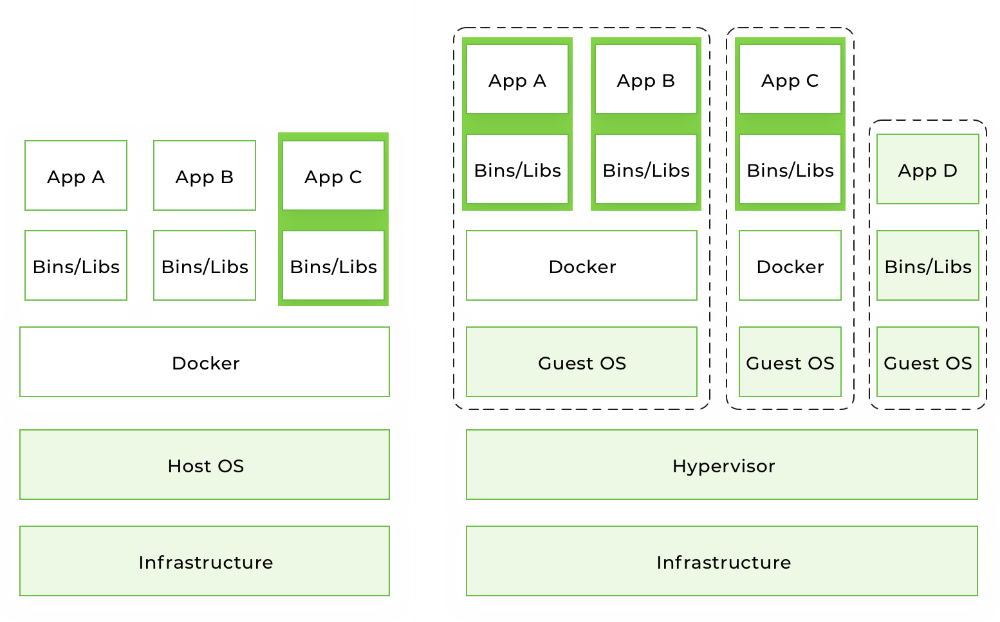

# Docker Introduction

## Table of contents

* [What is Docker?](#what-is-docker)
* [How does it differ from virtualization?](#how-does-it-differ-from-virtualization)
* [Why do we need Docker?](#why-do-we-need-docker)
* [Supported platforms](#supported-platforms)
* [Installation](#installation)
* [Terminology](#terminology)
* [Example 1: hello world](#example-1-hello-world)
* [Best practices for creating images](#best-practices-for-creating-images)
* [Alpine images](#alpine-images)
* [Docker way](#docker-way)
* [Conclusion](#conclusion)

## What is Docker?

[Docker](https://www.docker.com/) is an open-source tool that automates the deployment of an application inside a software container. 

When you develop an application, you need to provide your code along with all possible dependencies like libraries, the web server, databases, etc. You may end up in a situation when the application is working on your computer, but won't even start on the staging server, or the dev or QA's machine.

This challenge can be addressed by isolating the app to make it independent of the system.

## How does it differ from virtualization?

Traditionally, virtual machines were used to avoid this unexpected behavior. The main problem with VM is that an “extra OS” on top of the host operating system adds gigabytes of space to the project. Most of the time your server will host several VMs that will take up even more space. And by the way, at the moment, most cloud-based server providers will charge you for that extra space. Another significant drawback of VM is a slow boot.

Docker eliminates all the above by simply sharing the OS kernel across all the containers running as separate processes of the host OS.



Keep in mind that Docker is not the first and not the only containerization platform. However, at the moment Docker is the biggest and the most powerful player on the market.

## Why do we need Docker?

The short list of benefits includes:

* Faster development process
* Handy application encapsulation
* Same behaviour on local machine / dev / staging / production servers
* Easy and clear monitoring
* Easy to scale

### Faster development process

There is no need to install 3rd-party apps like PostgreSQL, Redis, Elasticsearch on the system -- you can run it in containers. Docker also gives you the ability to run different versions of same application simultaneously. For example, say you need to do some manual data migration from an older version of Postgres to a newer version. You can have such a situation in microservice architecture when you want to create a new microservice with a new version of the 3rd-party software.

It could be quite complex to keep two different versions of the same app on one host OS. In this case, Docker containers could be a perfect solution –- you receive isolated environments for your applications and 3rd-parties.

### Handy application encapsulation

You can deliver your application in one piece. Most programming languages, frameworks and all operating systems have their own packaging managers. And even if your application can be packed with its native package manager, it could be hard to create a port for another system.

Docker gives you a unified image format to distribute you applications across different host systems and cloud services. You can deliver your application in one piece with all the required dependencies (included in an image) ready to run.

### Same behaviour on local machine / dev / staging / production servers

Docker can't guarantee 100% dev / staging / production parity, because there is always the human factor. But it reduces to almost zero the probability of error caused by different versions of operating systems, system-dependencies, etc.

With right approach to building Docker images, your application will use the same base image with the same OS version and the required dependencies.

### Easy and clear monitoring

Out of the box, you have a unified way to read log files from all running containers. You don't need to remember all the specific paths where your app and its dependencies store log files and write custom hooks to handle this.

You can integrate an [external logging driver](https://docs.docker.com/config/containers/logging/configure/#supported-logging-drivers) and monitor your app log files in one place.

### Easy to scale

A correctly wrapped application will cover most of the [Twelve Factors](https://12factor.net/). By design, Docker forces you follow its core principles, such as configuration over environment variables, communication over TCP/UDP ports, etc. And if you've done your application right, it will be ready for scaling not only in Docker.

## Supported platforms

Docker's native platform is Linux, as it's based on features provided by the Linux kernel. However, you can still run it on macOS and Windows. The only difference is that on macOS and Windows, Docker is encapsulated into a tiny virtual machine. At the moment, Docker for macOS and Windows has reached a significant level of usability and feels more like a native app.

## Installation

You can check out the installation instructions for Docker [here](https://docs.docker.com/install/).

If you're running Docker on Linux, you need to run all the following commands as root or add your user to docker group and re-login:

```bash
sudo usermod -aG docker $(whoami)
```

## Terminology

* **Container** -- a running instance that encapsulates required software. Containers are always created from images. A container can expose ports and volumes to interact with other containers or/and the outer world. Containers can be easily killed / removed and re-created again in a very short time. Containers don't keep state.

* **Image** -- the basic element for every container. When you create an image, every step is cached and can be reused ([Copy On Write model](https://en.wikipedia.org/wiki/Copy-on-write)). Depending on the image, it can take some time to build. Containers, on the other hand, can be started from images right away.

* **Port** -- a TCP/UDP port in its original meaning. To keep things simple, let's assume that ports can be exposed to the outer world (accessible from the host OS) or connected to other containers –- i.e., accessible only from those containers and invisible to the outer world.

* **Volume** -- can be described as a shared folder. Volumes are initialized when a container is created. Volumes are designed to persist data, independent of the container's lifecycle.

* **Registry** – the server that stores Docker images. It can be compared to Github – you can pull an image from the registry to deploy it locally, and push locally built images to the registry.

* [**Docker hub**](https://hub.docker.com/explore/) -- a registry with web interface provided by Docker Inc. It stores a lot of Docker images with different software. Docker Hub is a source of the "official" Docker images made by the Docker team or in cooperation with the original software manufacturer (it doesn't necessary mean that these "original" images are from official software manufacturers). Official images list their potential vulnerabilities. This information is available to any logged-in user. There are both free and paid accounts available. You can have one private image per account and an infinite amount of public images for free. [**Docker Store**](https://store.docker.com/search?type=image&source=verified) -- a service very similar to Docker Hub. It's a marketplace with ratings, reviews, etc. My personal opinion is that it's marketing stuff. I'm totally happy with Docker Hub.


## Example 1: Hello world

It's time to run your first container:

```bash
docker run alpine echo 'Hello from my tiny container!'
```

Console output:

```
Unable to find image 'alpine:latest' locally
latest: Pulling from library/alpine
050382585609: Pull complete 
Digest: sha256:6a92cd1fcdc8d8cdec60f33dda4db2cb1fcdcacf3410a8e05b3741f44a9b5998
Status: Downloaded newer image for alpine:latest
Hello from my tiny container!

```

* **docker run** is a command to run a container.
* **alpine** is the image you run. For example, the alpine operating system image. When you specify an image, Docker looks first for the image on your Docker host. If the image does not exist locally, then the image is pulled from the public image registry -- Docker Hub.
* **echo 'Hello from my tiny container!'** is the command that will run inside a new container. This container simply prints 'Hello from my tiny container!' and stops the execution.

Let's try to create an interactive shell inside a Docker container:

```bash
docker run -i -t --rm alpine sh
```

* **-t** flag assigns a pseudo-tty or terminal inside the new container.
* **-i** flag allows you to make an interactive connection by grabbing the standard input (STDIN) of the container.
* **--rm** flag automatically removes the container when the process exits. By default, containers are not deleted. This container exists until we keep the shell session and terminates when we exit the session (like an SSH session with a remote server).

You can play with command line inside container:

```bash
ps aux
```

Console output:

```
PID   USER     TIME  COMMAND
    1 root      0:00 sh
    6 root      0:00 ps aux
```

```bash
du -d 1 -h
```

Console output:

```
4.0K	./home
16.0K	./media
4.0K	./mnt
3.7M	./lib
8.0K	./root
572.0K	./etc
0	./proc
4.0K	./opt
820.0K	./bin
496.0K	./usr
68.0K	./var
4.0K	./run
0	./dev
232.0K	./sbin
4.0K	./srv
0	./sys
4.0K	./tmp
5.9M	.
```

```bash
cat /etc/*release
```

Console output:

```
3.10.1
NAME="Alpine Linux"
ID=alpine
VERSION_ID=3.10.1
PRETTY_NAME="Alpine Linux v3.10"
HOME_URL="https://alpinelinux.org/"
BUG_REPORT_URL="https://bugs.alpinelinux.org/"
```

If you want to keep the container running after the end of the session, you need to daemonize it:

```bash
docker run --name daemon -d alpine /bin/sh -c "while true; do echo Hello from docker container\!; sleep 1; done"
```

* **--name daemon** assigns daemon name to a new container. If you don't specify a name explicitly, Docker will generate and assign it automatically.
* **-d** flag runs the container in the background (i.e., daemonizes it).

Let's see what running containers we have at the moment:

```bash
docker ps
```

Console output:

```
CONTAINER ID  IMAGE   COMMAND                 CREATED             STATUS                         PORTS  NAMES
CONTAINER ID        IMAGE               COMMAND                  CREATED             STATUS              PORTS               NAMES
1dbeeb615947        alpine              "/bin/sh -c 'while t…"   57 seconds ago      Up 56 seconds                           daemon
```


All containers (include stopped):

```bash
docker ps -a
```

Console output:

```
CONTAINER ID        IMAGE                           COMMAND                  CREATED              STATUS                      PORTS               NAMES
1dbeeb615947        alpine                          "/bin/sh -c 'while t…"   About a minute ago   Up About a minute                               daemon
678147dda7ea        alpine                          "echo 'Hello from my…"   13 minutes ago       Exited (0) 13 minutes ago                       recursing_elion
```


* **docker ps** is a command to list containers.
* **-a** shows all containers (without -a flag ps will show only running containers).

The **ps** shows us that we have two containers:

* **recursing_elion** (the name for this container was generated automatically – it will be different on your machine). It's the first container we created, the one that printed 'Hello from container' once.
* **daemon** -- the third container we created, which runs as a daemon.

Note: there is no second container (the one with interactive shell) because we set the **--rm option**. As a result, this container is automatically deleted right after execution.

Let's check the logs and see what the daemon container is doing right now:

```bash
docker logs -f daemon
```

Console output:

```
Hello from docker container!
Hello from docker container!
Hello from docker container!
Hello from docker container!
Hello from docker container!
Hello from docker container!
Hello from docker container!

```

* **docker logs** fetch the logs of a container.
* **-f** flag to follow the log output (works actually like **tail -f**).

Now let's stop the daemon container:

```bash
docker stop daemon
```

Make sure the container has stopped.

```bash
docker ps -a
```

Console output:

```
CONTAINER ID        IMAGE                           COMMAND                  CREATED              STATUS                       PORTS               NAMES
c6c2f82e6237        alpine                          "/bin/sh -c 'while t…"   About a minute ago   Exited (137) 5 seconds ago                       daemon
678147dda7ea        alpine                          "echo 'Hello from my…"   17 minutes ago       Exited (0) 17 minutes ago                        recursing_elion
```

The container is stopped. We can start it again:

```bash
docker start daemon
```

Let's ensure that it's running:

```bash
docker ps
```

Console output:

```
CONTAINER ID        IMAGE               COMMAND                  CREATED              STATUS              PORTS               NAMES
c6c2f82e6237        alpine              "/bin/sh -c 'while t…"   About a minute ago   Up 8 seconds                            daemon

```

Now, stop it again and remove the container manually:

```
docker stop daemon
docker rm daemon
```

To remove all containers, we can use the following command:

```bash
docker rm -f $(docker ps -aq)
```

* **docker rm** is the command to remove the container.
* **-f** flag (for rm) stops the container if it's running (i.e., force deletion).
* **-q** flag (for ps) is to print only container IDs.


## Example 2: Ubuntu-based Nginx web-server 

Download ubuntu docker image (by default pull uses latest tag of the image of the latest version of the OS)

```bash
docker pull ubuntu
Using default tag: latest
latest: Pulling from library/ubuntu
Digest: sha256:9b1702dcfe32c873a770a32cfd306dd7fc1c4fd134adfb783db68defc8894b3c
Status: Image is up to date for ubuntu:latest
```

Run container in interactive mode and go inside:

```
docker run -ti ubuntu bash
root@2c8c9023d3cd:/# 
```

```bash
hostname
2c8c9023d3cd

whoami
#...
cat /etc/*release
#...
ps aux
### etc
```

Let's try to install nginx inside the container:

```bash
root@2c8c9023d3cd:/# apt-get install nginx
Reading package lists... Done
Building dependency tree       
Reading state information... Done
E: Unable to locate package nginx

apt-get update
# ...
apt-get install nginx
# ...
nginx -t
# ...
dpkg -l | grep nginx
# ...
cat /etc/nginx/nginx.conf
# ...
exit
```

On the host machine:

```bash
docker ps -a
CONTAINER ID        IMAGE               COMMAND                  CREATED             STATUS                     PORTS               NAMES
2c8c9023d3cd        ubuntu              "bash"                   10 minutes ago      Exited (0) 4 seconds ago                       pedantic_gagarin


docker start 2c8c9023d3cd
2c8c9023d3cd
dmitrii@dmitrii-HP-EliteBook-850-G5:~/git/docker-intro$ docker ps
CONTAINER ID        IMAGE               COMMAND             CREATED             STATUS              PORTS               NAMES
2c8c9023d3cd        ubuntu              "bash"              11 minutes ago      Up 2 seconds                            pedantic_gagarin


docker exec -ti 2c8c9023d3cd bash


root@2c8c9023d3cd:/# 

ps aux
USER       PID %CPU %MEM    VSZ   RSS TTY      STAT START   TIME COMMAND
root         1  0.5  0.0  18508  3172 pts/0    Ss+  05:30   0:00 bash
root        11  2.0  0.0  18508  3364 pts/1    Ss   05:31   0:00 bash
root        20  0.0  0.0  34400  2772 pts/1    R+   05:31   0:00 ps aux


nginx
#...
ps aux
# ...
apt install curl
# ...
curl localhost
# ...
ss -a -l -t
State                 Recv-Q                 Send-Q                                   Local Address:Port                                   Peer Address:Port                 
LISTEN                0                      128                                            0.0.0.0:80                                          0.0.0.0:*                    
LISTEN                0                      128                                               [::]:80                                             [::]:*                    


echo "daemon off;" >> /etc/nginx/nginx.conf
exit
```


```bash
docker ps
CONTAINER ID        IMAGE               COMMAND             CREATED             STATUS              PORTS               NAMES
b7ca8d464dcf        ubuntu              "bash"              15 minutes ago      Up 6 minutes                            vigilant_gauss

docker stop vigilant_gauss 

docker commit vigilant_gauss myubuntu
sha256:88b424844041fbd2964fe71f298409c71ab3c2a64431f92189f1e3b28a91d99e
dmitrii@dmitrii-HP-EliteBook-850-G5:~$ docker images
REPOSITORY                   TAG                 IMAGE ID            CREATED             SIZE
myubuntu                     latest              88b424844041        3 seconds ago       160MB

docker run -d --entrypoint=nginx myubuntu
9c6cab6961cb7262add38c633d47f0a89ed6e246fe42438f1a5fdf2cf80c79ec
dmitrii@dmitrii-HP-EliteBook-850-G5:~$ docker ps
CONTAINER ID        IMAGE               COMMAND             CREATED             STATUS              PORTS               NAMES
9c6cab6961cb        myubuntu            "nginx"             3 seconds ago       Up 1 second                             vigilant_hamilton


docker exec vigilant_hamilton ps aux
USER       PID %CPU %MEM    VSZ   RSS TTY      STAT START   TIME COMMAND
root         1  1.9  0.0 141104 11008 ?        Ss   06:11   0:00 nginx: master process nginx
www-data     6  0.0  0.0 141480  3496 ?        S    06:11   0:00 nginx: worker process
www-data     7  0.0  0.0 141480  3496 ?        S    06:11   0:00 nginx: worker process
www-data     8  0.0  0.0 141480  3496 ?        S    06:11   0:00 nginx: worker process
www-data     9  0.0  0.0 141480  3496 ?        S    06:11   0:00 nginx: worker process
www-data    10  0.0  0.0 141480  3496 ?        S    06:11   0:00 nginx: worker process
www-data    11  0.0  0.0 141480  3496 ?        S    06:11   0:00 nginx: worker process
www-data    12  0.0  0.0 141480  3496 ?        S    06:11   0:00 nginx: worker process
www-data    13  0.0  0.0 141480  3496 ?        S    06:11   0:00 nginx: worker process
root        14 22.0  0.0  34400  2768 ?        Rs   06:11   0:00 ps aux


docker stop vigilant_hamilton

docker run -d -p 80:80 --entrypoint=nginx myubuntu

docker ps
CONTAINER ID        IMAGE               COMMAND             CREATED             STATUS              PORTS                NAMES
8bc3807d3aef        myubuntu            "nginx"             3 seconds ago       Up 1 second         0.0.0.0:80->80/tcp   romantic_colden

curl localhost

docker exec -ti romantic_colden bash

ls -la /var/www/html

cat /var/www/html/index.nginx-debian.html 

sed -i 's/Welcome to nginx/Hello from Docker container/g' /var/www/html/index.nginx-debian.html 

```

Open in browser http://localhost


Let's build docker image  based on Dockerfile

```
bash

docker build -t nginx .

docker run -d -p 80:80 nginx

curl localhost

docker logs -f <container_name>

```

Forward access and error logs to stdout and stderr inside the docker to use standard logging features of the docker:

```Dockerfile
# forward request and error logs to docker log collector
RUN ln -sf /dev/stdout /var/log/nginx/access.log \
    && ln -sf /dev/stderr /var/log/nginx/error.log
```

And rebuild the image.  

## Best practices for creating images

* Include only **necessary context** -- use a [**.dockerignore**](https://docs.docker.com/engine/reference/builder/#dockerignore-file) file (like .gitignore in git)
* Avoid installing **unnecessary packages** -- it will consume extra disk space.
* **Use cache**. Add context which changes a lot (for example, the source code of your project) at the end of Dockerfile -- it will utilize Docker cache effectively.
* **Be careful with volumes**. You should remember what data is in volumes. Because volumes are persistent and don't die with the containers, the next container will use data from the volume created by the previous container.
* Use [**environment variables**](https://docs.docker.com/engine/reference/builder/#environment-replacement) (in RUN, EXPOSE, VOLUME). It will make your Dockerfile more flexible.

## Alpine images

A lot of Docker images (versions of images) are created on top of [**Alpine Linux**](https://alpinelinux.org/) -- this is a lightweight distro that allows you to reduce the overall size of Docker images.

I recommend that you use images based on Alpine for third-party services, such as Redis, Postgres, etc. For your app images, use images based on [**buildpack**](https://hub.docker.com/_/buildpack-deps/) -- it will be easy to debug inside the container, and you'll have a lot of pre-installed system-wide requirements.

Only you can decide which base image to use, but you can get the maximum benefit by using one basic image for all images, because in this case the cache will be used more effectively.

## Docker way

Docker has some restrictions and requirements, depending on the architecture of your system (applications that you pack into containers). You can ignore these requirements or find some workarounds, but in this case, you won't get all the benefits of using Docker. My strong advice is to follow these recommendations:

* **1 application = 1 container**.
* Run process in the **foreground** (don't use systemd, upstart or any other similar tools).
* **Keep data out of container** -- use volumes.
* **Do not use SSH** (if you need to step into container you can use docker exec command).
* **Avoid manual configurations** (or actions) inside container.

## Conclusion

To summarize this tutorial, alongside with IDE and Git, Docker has become a must-have developer tool. It's a production-ready tool with a rich and mature infrastructure.

Docker can be used on all types of projects, regardless of size and complexity. In the beginning, you can start with [compose](https://docs.docker.com/compose/overview/) and [Swarm](https://docs.docker.com/engine/swarm/). When the project grows, you can migrate to cloud services like [Amazon Container Services](https://aws.amazon.com/containers/) or [Kubernetes](https://kubernetes.io/).

Like standard containers used in cargo transportation, wrapping your code in Docker containers will help you build faster and more efficient CI/CD processes. This is not just another technological trend promoted by a bunch of geeks –- it's a new paradigm that is already being used in the architecture of large companies like [PayPal](https://blog.docker.com/2017/12/containers-at-paypal/), [Visa](https://blog.docker.com/2017/04/visa-inc-gains-speed-operational-efficiency-docker-enterprise-edition/), [Swisscom](https://www.docker.com/customers/swisscom-goes-400vms-20vms-docker), [General Electric](https://www.docker.com/customers/ge-uses-docker-enable-self-service-their-developers), [Splink](https://www.docker.com/customers/docker-datacenter-delivers-splunks-house-demos), etc.